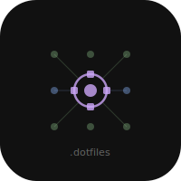
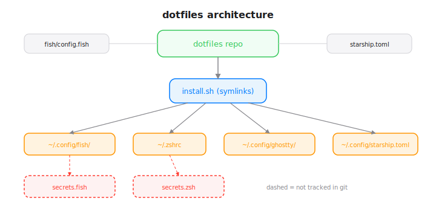

# dotfiles


Shell and terminal config for macOS (Apple Silicon).

## What's tracked

- **fish** - Fish shell config (aliases, abbreviations, tool init)
- **zsh** - Zsh config (PATH, aliases, completions, tool init)
- **ghostty** - Ghostty terminal (JetBrainsMono Nerd Font, fish shell)
- **starship** - Starship prompt (Catppuccin Mocha, Powerline glyphs)

## Architecture



## Prerequisites

- [Homebrew](https://brew.sh)
- fish, starship, eza, bat, fd, fzf, zoxide, atuin, fnm (all via brew)
- [JetBrainsMono Nerd Font](https://www.nerdfonts.com/)
- [Ghostty](https://ghostty.org)

## Install

```sh
git clone https://github.com/nulljosh/dotfiles.git ~/Documents/Code/dotfiles
cd ~/Documents/Code/dotfiles
chmod +x install.sh
./install.sh
```

Secrets (API keys) are stored in `~/.config/fish/secrets.fish` and `~/.config/zsh/secrets.zsh`, which are not tracked.

## License

MIT 2026, Joshua Trommel
