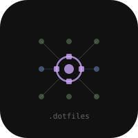
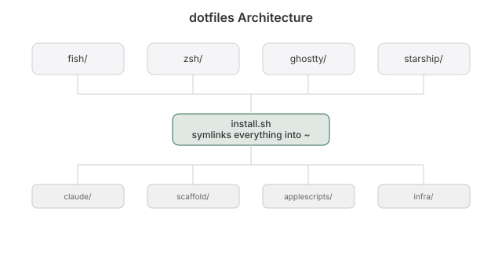

# dotfiles


My shell, my terminal, my prompt. Everything a fresh Mac needs to feel like mine in one command.


## Features

- **fish**: the daily shell. Aliases, abbreviations, tool init
- **zsh**: the same PATH, aliases and completions, for scripts and remote boxes
- **ghostty**: the terminal. JetBrainsMono Nerd Font, fish inside
- **starship**: the prompt. Catppuccin Mocha, Powerline glyphs

## Run

```bash
git clone https://github.com/nulljosh/dotfiles.git ~/Documents/Code/dotfiles
cd ~/Documents/Code/dotfiles
chmod +x install.sh
./install.sh
```

You need [Homebrew](https://brew.sh), then fish, starship, eza, bat, fd, fzf, zoxide, atuin and fnm from it. Plus [JetBrainsMono Nerd Font](https://www.nerdfonts.com/) and [Ghostty](https://ghostty.org).

API keys live in `~/.config/fish/secrets.fish` and `~/.config/zsh/secrets.zsh`. Neither is tracked. Neither ever will be.

## Roadmap

- [ ] Add a bootstrap script to install Homebrew and required packages.
- [ ] Add OS and shell version checks before running install.
- [ ] Add a pre-commit check to ensure secrets files are excluded.

## Changelog

- v1.0.0: Added fish shell config with aliases, abbreviations, and tool init.
- v1.0.0: Added zsh config with PATH, aliases, completions, and tool init.
- v1.0.0: Added Ghostty and Starship configs plus the install.sh symlink installer.

## License

MIT 2026 Joshua Trommel
