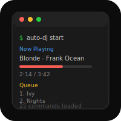

# AppleScripts


macOS automation toolkit. 16 CLI tools behind a unified `mac` dispatcher.

## Features

- Window management, app control, clipboard, system settings
- Network, disk, process, input device, and keychain utilities
- Apple Music playback, search, queue, playlist management
- Multi-step workflow engine with 5 built-in workflows
- Background Auto-DJ daemon (mood/genre-aware queueing)

## Run

```bash
./install.sh            # symlinks bin/* to ~/.local/bin
./install.sh --uninstall

mac music play drake
mac win left Terminal
mac sys volume 50
mac flow run morning

musicctl play drake
winctl left Terminal
```

## Roadmap

- [ ] Smart queue (tempo/energy-aware Auto-DJ)
- [ ] Play count analytics dashboard
- [ ] Workflow sharing/import

## Changelog

- v2.0.0
  - Unified macOS automation under the `mac` dispatcher with 16 CLI tools.
  - Added workflow engine with five built-in workflows.
  - Added background Auto-DJ daemon with mood/genre-aware queueing.

## License

MIT 2026 Joshua Trommel
