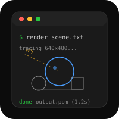
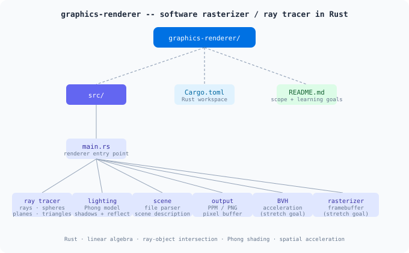

# Graphics Renderer

A software rasterizer / ray tracer in Rust  --  render 3D scenes to images.

## Scope
- Ray tracer: rays, spheres, planes, triangles
- Phong lighting model
- Shadows and reflections
- PPM/PNG image output
- Scene description file parser
- BVH acceleration (stretch goal)
- Real-time rasterizer with framebuffer (stretch goal)

## Learning Goals
- Linear algebra (vectors, matrices, transforms)
- Ray-object intersection math
- Lighting and shading models
- Spatial acceleration structures
- Image formats and pixel manipulation
- Performance optimization in Rust

## Project Map

