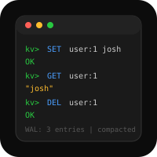

# Key-Value Store

A persistent key-value database in Rust, inspired by Bitcask/RocksDB.

## Scope
- In-memory hash index with disk-backed log
- Get, set, delete operations
- Log-structured storage with compaction
- Simple TCP server for client access
- Crash recovery from write-ahead log
- Concurrent access (stretch goal)

## Learning Goals
- Log-structured storage engines
- File I/O and serialization in Rust
- Hash indexes and storage trade-offs
- Ownership and borrowing in a real system
- Network programming basics

## Project Map

## Project Map

